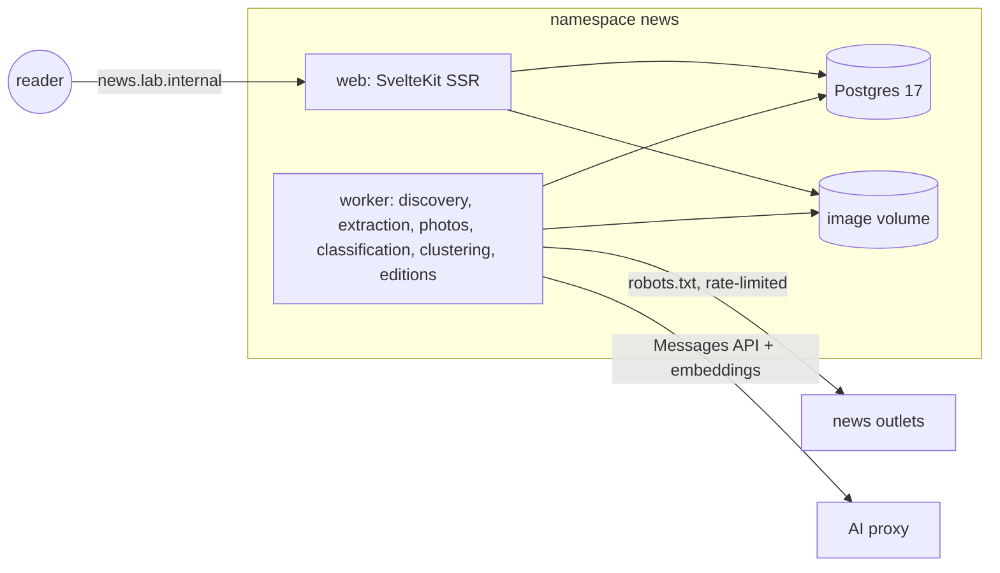

# Shilly Shally News: design

`SPEC.md` is the pre-generated requirement spec. This document records what we keep from it, what we
change and why, and the design we actually build. Where the two disagree, this document wins.

## 1. What must stay true

1. Readers are sensitive to different things, so every reader configures what to avoid.
2. It looks and reads like a traditional newspaper.
3. Every article is readable in full on our site, text and photos, without visiting the outlet.
4. Discovery uses RSS and also news sitemaps, outlet APIs and page scraping.
5. Paywalled articles are skipped unless the household subscribes; HS paid articles are read through
   a subscriber session (§4).

Plus one rule that follows from them: **a reader never sees what they asked not to see**, anywhere
(lists, search, article pages, photos, cluster "also in" lines), and nothing on screen hints at what was
hidden.

## 2. Spec review: kept, changed, dropped

| Spec | Decision | Why |
|---|---|---|
| Separate frontend + REST backend + bearer tokens (§2, §6.2) | **One SvelteKit server-rendered app + one worker**, sharing `src/lib/core`. Database sessions in an httpOnly cookie. | The only client is our website. Server rendering means filtered data never reaches the browser, so no API surface to probe. Database sessions are revocable by deleting rows; the spec's "token generation counter" exists only to patch the revocation problem that stateless tokens create. |
| Email + open registration (§6.1) | **Invite-only, no email.** Admin creates single-use invite links. | Friends and family. Open sign-up would turn a private reading room into a public republishing service (see §9 licensing). |
| Local model / provider abstraction (§4.1) | **Claude through the AI proxy only**, model chosen by benchmark (§5.4). One client (`llm.ts`) with structured JSON-schema output. | Accuracy matters more than self-hosting here; CPU-only local models on this host are too slow and too weak at the intensity judgement. The model is configuration (`LLM_MODEL`). No fallback provider: a failing call is retried later, and the article stays hidden until classified. |
| Images are **not** assessed; gate all inline images on the reader's settings (§9.1.4) | **Every stored photo is assessed by the vision model** in the same call as the text. Per-photo tags gate each photo individually against the reader's thresholds. Unassessed photos wait behind "Show photo". | Claude reads images. Assessing them removes the spec's biggest blind spot (a cheerful spider story with a close-up photo) and lets most readers see most photos. |
| Excerpt-only articles stay visible, with deadlines, minimum intensities and upward-only re-classification (§3.2, §4.6) | **Only fully extracted articles are classified and shown.** Paywalled, failed and skipped articles are stored for monitoring and never shown. | Idea 3: a teaser that sends the reader to the outlet is not a news item we can deliver. It also deletes a whole class of under-protection (classifying on teasers) and the machinery built to compensate for it. Outlets with a high paywall share (Länsiväylä, Kauppalehti) are simply not enabled until credentials exist. |
| Hourly polling | Discovery every 10-20 min per outlet (respecting crawl-delay); **front page published as editions** at 06:30, 12:00 and 17:00 Helsinki time; a quiet **Latest** page for everything since. | A calm product should not change under the reader every few minutes, and a finite front page ("that is today's edition") is the opposite of an anxiety feed. |
| Breaking flag + ticker (§4.2, §9.1.5) | **Dropped.** Classifier gives an **importance** 1-5 used for front-page placement. | Tickers are alarm design. Importance gives the same placement signal without urgency cues. |
| Persons directory, trending persons (§7.3, §4.2) | **Dropped.** | Little reading value; costs prompt tokens, a normalisation problem for Finnish names, and another leak surface. |
| Story clusters (§4.7) | **Kept, as de-duplication.** Embeddings (`text-embedding-3-small` via the proxy) of calm headline + summary; articles from different outlets within 48 h above a similarity threshold share a `cluster_id`. Front page shows one visible member per cluster with "Also in Ilta-Sanomat, MTV". | Seven Finnish outlets report the same story; without this the front page repeats itself. Cross-language works (fi/en same-story cosine 0.69 vs 0.28 unrelated). |
| For You, trending topics, reading statistics and streaks, unread counts, new counts (§7.1, §7.6) | **Dropped.** | Engagement mechanics. Streaks and counts create pressure; personalised ranking narrows. Reading state is kept only to dim already-read headlines. |
| Collections, user-submitted links, export/import (§7.4-7.5, §6.4) | **Dropped for now; "Save" (one list) kept.** | Submitted links are an SSRF and cost surface for little gain in a household product. |
| Command palette, keyboard shortcuts, preview overlay, reader-view toggle, print stylesheet (§9.1.6) | **Search box + a print stylesheet only.** | Primary devices are iPad and phone. The article page already is the reader view. |
| Topic preference as "enabled topics" | **Hidden topics** (default none); an article is hidden when **any** of its topics is hidden. | Safer default when the taxonomy grows: a new topic is visible, not silently excluded. "Hide weather" then means no weather at all, not "weather unless it is also world news". Sensitivity tags keep the spec's rule: family thresholds are applied at the moment of setting, never inherited live. |
| "Show anyway" (§5.3) | **Dropped.** | No context in this product where it is needed. |
| Keyword blocklist on title + summary (§5.1) | Matches **title, calm headline, summary, body and captions**, with Finnish and English stemming plus accent-insensitive prefix matching. | A word the reader blocks can sit in paragraph 9. Over-blocking is the accepted direction. |
| MetalLB (§12.1) | k3s ServiceLB + Traefik ingress, like every app here. | Already the platform. |
| Spec §8 admin | Kept: outlet status and priority, pipeline monitoring, model latency/cost/errors, reports queue, tag corrections with audit (`tag_corrections`), body purge (the article leaves every reader page; the record and classification stay), users and invites. Dropped: person tagging, analytics dashboards. | |

## 3. Architecture

- `src/lib/core/`: shared by web and worker (relative imports only): taxonomy, db, http, outlets,
  extraction, images, llm, classify, visibility, editions, auth, prefs.
- Photos are downloaded once, stored as WebP under the image volume and served by the web app. The
  reader's browser never contacts an outlet.
- The worker is the only component with internet egress (NetworkPolicy); web reaches only Postgres.
- Schema: versioned SQL migrations (`migrations/NNN_*.sql`), applied at start by whichever of web
  and worker starts first (advisory-locked runner).

## 4. Ingestion

Per outlet, one module in `src/lib/core/outlets/` with `discover()` and `extract(url)`; see the
research in `docs/outlets.md`. Body sources are the outlets' embedded state JSON (Yle, IS, HS,
Iltalehti) or server-rendered HTML (MTV, Seiska, NPR); never the JSON-LD `articleBody` (nobody sets it).

- **Discovery**: RSS, Google News sitemaps, outlet listing APIs. URLs normalised (tracking parameters
  removed) and de-duplicated by URL.
- **Extraction** produces our own block model (`blocks.ts`): paragraphs, subheads, quotes, lists and
  figures. No outlet HTML is stored or rendered.
- **Paywall**: the outlet's own lock flag decides, never text length. A locked article is stored as
  `paywalled` with no body, **even when the page ships the full text in its state JSON** (Alma Talent
  does this; reading it would be circumvention).
- **Subscriber sessions** (`sessions.ts`, Sanoma flow in `outlets/sanoma.ts`): for outlets the
  household subscribes to, the worker owns a dedicated login (secret `COOKIES_<SLUG>`: the outlet's
  login cookie copied from a private browser window). Sanoma serves one shared CDN copy of every
  article page, so the worker follows the HS web app: login cookie → short-lived session token
  (`/api/safe/v2/web/session-token`; single-flight, cached until expiry, because the login cookie
  rotates on every exchange) → Sanoma's access service, whose `access-granted` answer carries the
  subscriber body in the same `splitBody` format. Cookies go only to the outlet's own https hosts and
  the token only to the access service, never across redirects; the newest login cookie is kept in
  `outlet_sessions`. The access service decides, as the paywall flag does for anonymous pages; every
  paid article doubles as a session check shown on the admin Outlets page. Automating the login
  itself was rejected: it runs behind DataDome bot detection and a scripted login risks the account.
  The site is household-only, which keeps this within the personal subscription.
- **Crawler manners**: single hardened client (`http.ts`): robots.txt per host, per-host pacing and
  crawl-delay, identifying User-Agent plus `From`, size and time caps, private address ranges blocked
  (also by NetworkPolicy).
- **Initial outlets**: Yle, Ilta-Sanomat, Iltalehti, MTV Uutiset, Helsingin Sanomat (free and metered
  articles), Seiska, NPR. Not enabled: Kauppalehti, Uusi Suomi, Länsiväylä (mostly locked); BBC,
  Reuters, AP, Guardian (terms forbid or require a licence).

## 5. Classification

### 5.1 One call per article
Input: headline, standfirst, full body (structurally abridged above 40 000 characters, with the length
declared), captions, and up to 8 photos as 768 px JPEGs. Output (JSON schema): 1-3 topics, sensitivity
tags with intensity and basis (text/images/both), per-photo tags, calm headline, neutral summary,
importance 1-5, kind (news, opinion, ..., sponsored), language. The long system prompt (taxonomy) is
identical for every call, so the proxy's prompt cache serves it.

### 5.2 Safety rules in code, not only in the prompt
- Unclassified or failed articles are never visible.
- A tag found on a photo is also an article tag at that intensity.
- Duplicate tags keep the highest intensity.
- Sponsored content is never shown.
- Admin corrections (`origin = 'manual'`) override AI tags and survive re-classification.

### 5.3 Priority
Queue order: outlet priority, then newest first. Classification runs with bounded concurrency.

### 5.4 Model choice
**`claude-sonnet-5-5`** (`LLM_MODEL`), from `docs/benchmark.md` (20 real, mostly sensitive articles,
each model run twice, `claude-opus-5-5` as reference): p50 3.9 s / p90 4.9 s, the fastest measured;
23-25 % under-calls against the stable reference versus 40-42 % for `claude-sonnet-5` and 48-54 % for
`claude-haiku-4-5`; it caught phobia animals in photos, and its calm headlines and summaries match
Opus. `claude-opus-5-5` is ~1.5 s slower and the most accurate; switching is a one-line config change
if its price is acceptable. Haiku is ruled out (missed half the tags, wrote a false summary).

Clustering: `text-embedding-3-small`, cosine >= 0.70 to an article from another outlet within 48 h
(measured on 29 000 cross-outlet pairs: >= 0.80 same report, 0.70-0.80 same event, below 0.70 false
pairs appear).

## 6. Filtering

`visibility.ts` is the one SQL predicate every reader query uses. It enforces: classified and
extracted, not sponsored, at least one non-hidden topic, outlet not hidden, no effective tag at or
above the reader's threshold, not muted (reporting an article also mutes it), no blocked-term match.
Leak tests in `tests/visibility.test.ts` run against real Postgres.

Non-disclosure: no tags on cards or pages, no counts, no "N hidden", cursor pagination only, the
article URL of a hidden article returns the same 404 as a missing one, and the "Also in" line of a
cluster lists only members visible to this reader.

Photos: setting **show** (default) shows a photo when it was assessed and none of its tags hit the
reader's thresholds; anything else is behind a neutral "Show photo" button that names nothing. **Ask
first** puts every photo behind the button; **no photos** removes them.

## 7. Reader experience

### 7.1 Principles
- **Finite and calm.** The front page is an edition. Below the last story: "That is the Midday Edition.
  The Evening Edition is out at 17:00." No infinite scroll, badges, counters, red dots or autoplay.
- **Calm headlines by default.** The classifier's rewrite replaces clickbait; the outlet's headline is
  shown small on the article page. A setting turns it off.
- **Reader control is one tap away.** On every article: *Save*, *Not for me* (mutes it) and *This
  upset me* (hides it at once and queues it for admin review; no description needed).
- **Same design on every device**, reflowed: broadsheet grid on desktop, 2-3 columns on iPad, a single
  "column inch" stack on phones. Touch targets at least 44 px.

### 7.2 Pages
| Path | Content |
|---|---|
| `/` | Front page of the current edition: lead story (largest headline, photo, summary), 2-3 secondary stories, "In brief" column, then one block per section. One story per cluster. |
| `/section/<key>` | Section front: same grid, that section's stories in the edition window, then "Earlier" (cursor). |
| `/latest` | Everything visible, newest first, published after the edition too. Plain list, cursor pagination. |
| `/article/<id>` | Kicker, calm headline, standfirst, byline line (outlet, time, reading time), lead photo, body with drop cap and figures, original headline and "Read at <outlet>" link, actions, "Also in" (same cluster, visible only), more from the section. |
| `/search` | Full-text search (Finnish and English stemming) over visible articles. |
| `/saved` | Saved articles, still filtered (a saved article that a later settings change hides disappears). |
| `/settings` | Comfort level, sensitivity by family and tag, topics, outlets, blocked words, photos, headlines, theme, password, sign out everywhere. |
| `/welcome` | First-run: 1) what this is, 2) pick a comfort preset (4 cards), 3) optional fine-tuning of families, 4) photos and headlines, 5) done. Before any news is shown. |
| `/login`, `/join/<code>` | Sign in; redeem invite. |
| `/admin` | Outlets, pipeline and model health, reports with tag correction, users and invites. |

### 7.3 Visual system ("modern broadsheet")
- Masthead: *Shilly Shally News* in UnifrakturMaguntia between hairline rules; dateline strip in
  letterspaced small caps: weekday and date, edition name, "Espoo", "Updated 12:00".
- Section bar: one line of small-caps links with thin vertical rules, horizontally scrollable on
  phones; condensed sticky bar on scroll.
- Type: Playfair Display (headlines, size encodes importance on a 7-step modular scale), Source Serif 4
  (body, 60-72 characters per line, `text-wrap: pretty`), Libre Franklin (kickers, bylines, captions,
  UI). All self-hosted via Fontsource, `font-display: swap`, serif fallbacks.
- Colour: newsprint `#F7F4EC`, ink `#16130F`, one accent (printer's red `#A32020`) for section kickers
  and focus; dark "Late Edition" `#14120F` with warm off-white. Theme follows the system unless set.
- Rules, not boxes: hairline column rules, double rules between major blocks, section heads as
  small-caps labels on a rule. No cards, shadows or rounded corners.
- Photos: hairline frame, caption in italic serif with small-caps credit; slightly muted saturation
  for a print feel; aspect-ratio boxes so nothing reflows.
- Accessibility: WCAG AA contrast, visible focus rings drawn as ink outlines, landmarks and heading
  order follow the reading order, layout survives 200 % zoom, `prefers-reduced-motion` honoured.

## 8. Operations
- Containers: one image, two entrypoints (`node build/index.js` web, `node build/worker.js` worker).
- k8s: namespace `news`, Postgres StatefulSet (local-path volume), image PVC shared by web and worker
  (single node, ReadWriteOnce is fine), Traefik ingress `news.lab.internal`, NetworkPolicy (web:
  Postgres only; worker: Postgres, DNS and public internet only, no private ranges).
- Secrets (not in git): `news-db` (`POSTGRES_PASSWORD`), `news-llm` (`LLM_API_KEY` from the omp config).
- Logs: counts, latencies, token usage; never article text or keys.

## 9. Risks
- **Licensing.** Showing full articles and photos is republishing. Acceptable only as a private,
  invite-only reading room for family and friends; it must not be opened to the public. Several
  outlets reserve text-and-data-mining rights; BBC, Reuters, AP and Guardian are excluded for that
  reason.
- **Classifier misses.** Mitigated by: full text plus photos, "include when unsure" prompt, highest
  intensity wins, photo tags lift article tags, reader report path, admin corrections.
- **Site redesigns** break extractors. Admin outlet view shows per-outlet extraction states; a jump in
  `failed` means an extractor needs fixing.

## 10. Phases
1. **Now**: everything above, for the seven initial outlets.
2. **Next**: subscriber sessions for Iltalehti; few-shot examples from `tag_corrections` in the
   prompt. HS (and IS) subscriber sessions are in place.
3. **Later**: public exposure through Cloudflare Tunnel only if licensing allows (it currently does
   not), English-language outlets with a licence.
